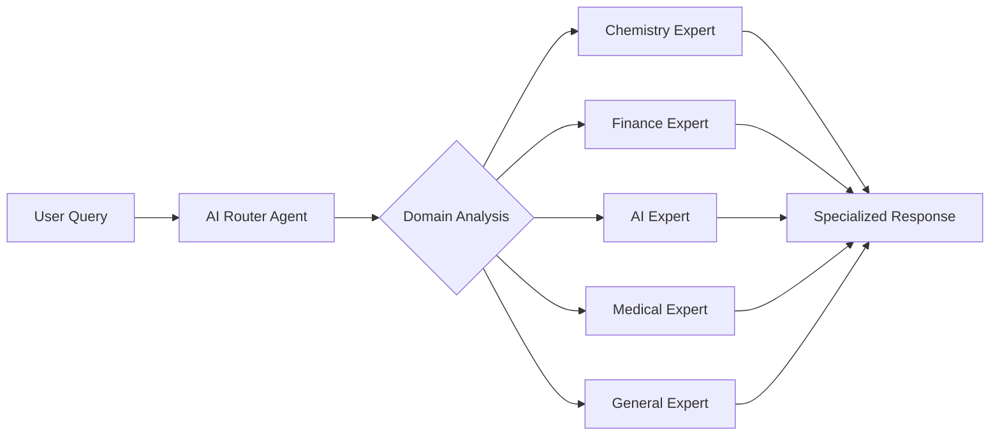

# 🧠 Adaptive Minds

**Intelligent multi-agent AI system that dynamically selects specialized domain experts for your queries**

[](https://opensource.org/licenses/Apache-2.0)
[](https://huggingface.co/collections/pavan01729/adaptive-minds-68cbab3565664604be49a462)
[](https://www.python.org/downloads/)
[](https://www.docker.com/)

Adaptive Minds transforms LoRA adapters into **specialized tools** for AI agents. Instead of using a single general-purpose model, it employs an intelligent router that automatically selects the most appropriate LoRA adapter for each query, effectively giving the AI agent access to domain-specific expertise on demand.


## ✨ Key Features

- 🎯 **Intelligent Routing**: AI automatically selects the best domain expert for each query
- 🧠 **5 Domain Experts**: Chemistry, Finance, AI, Medical, and General knowledge
- 🔄 **Multi-Agent Architecture**: Built with LangGraph for robust workflow management
- 🔧 **Fully Configurable**: YAML-based configuration, no code changes needed
- 🚀 **Two Deployment Modes**: 
  - **Docker** - One-command deployment with pre-configured experts
  - **Playground** - Train, customize, and deploy your own experts
- 💬 **Dual Interface**: FastAPI backend + Streamlit web UI
- 📊 **Transparent Reasoning**: See why each expert was selected
- 🔗 **Conversation Memory**: Context-aware responses across interactions

## 🏗️ How It Works



1. **User sends a query** via API or web interface
2. **AI Router Agent** analyzes the query using the base Llama 3.1 model
3. **Domain selection** happens through semantic understanding
4. **Expert Agent** generates response using the selected domain-specific LoRA adapter
5. **Response delivered** with reasoning about why that expert was chosen

---

## 🚀 Quick Start (Docker)

**Get up and running in 5 minutes with pre-configured experts.**

### Prerequisites
- Docker & Docker Compose
- NVIDIA GPU with 8GB+ VRAM
- HuggingFace account (for Llama 3.1 access)

### 1. Get HuggingFace Access

**Required:** You need access to Meta's Llama 3.1 model on HuggingFace.

1. **Create a HuggingFace account** at [huggingface.co](https://huggingface.co)

2. **Accept the Llama 3.1 license:**
   - Visit: https://huggingface.co/meta-llama/Llama-3.1-8B-Instruct
   - Click "Accept" on the license agreement
   - Wait for approval (usually instant)

3. **Get your access token:**
   - Go to: https://huggingface.co/settings/tokens
   - Create a new token with "Read" permissions
   
   **💡 Recommended:** Create a `.env` file for persistent storage:
   ```bash
   # Create .env file in project root
   cat > .env << EOF
   HF_TOKEN=your_actual_token_here
   EOF
   ```
   
   **Alternative:** Copy and edit the example template:
   ```bash
   cp .env.example .env
   nano .env  # Edit with your actual token
   ```
   
   ⚠️ **Security Note:** The `.env` file is already in `.gitignore` - never commit tokens to version control!

4. **Verify access:**
   ```bash
   # Test your token works
   curl -H "Authorization: Bearer $HF_TOKEN" \
        https://huggingface.co/api/models/meta-llama/Llama-3.1-8B-Instruct
   ```

### 2. Start the System

```bash
git clone https://github.com/qpiai/adaptive-minds.git
cd adaptive-minds

# Create .env file with your HF token (if not done already)
echo "HF_TOKEN=your_actual_token_here" > .env

# Start the system (first run downloads ~16GB of models)
docker compose up
```

**🕐 First Run:** Initial startup takes ~15-20 minutes to download models. Watch for "🎉 ALL SYSTEMS READY!" message.

The system will:
- Download base model and 5 LoRA adapters from HuggingFace
- Start FastAPI server (port 8765)
- Start Streamlit UI (port 8501)

### 3. Access the System

**Web Interface:**
- Open http://localhost:8501 for the Streamlit UI

**API Interface:**
```bash
# Send a query
curl -X POST http://localhost:8765/chat \
  -H "Content-Type: application/json" \
  -d '{"query": "What is the molecular formula of caffeine?"}'

# Check system status
curl http://localhost:8765/status
```

**📚 See [QUICKSTART.md](QUICKSTART.md) for detailed Docker deployment guide**

---

## 🧪 Development Mode (Playground)

**For training custom experts and advanced configuration.**

The `playground/` directory provides a complete development environment where you can:
- Train custom LoRA experts on any HuggingFace dataset
- Mix pre-trained and custom models
- Configure routing behavior dynamically
- Test and validate your setup

### Setup

```bash
# Install dependencies
uv sync

# Or with training capabilities
uv sync --extra training

# Activate environment
source .venv/bin/activate
cd playground
```

### Configuration

Edit `playground/models_config.yaml` to configure your experts:

```yaml
# Add any HuggingFace model
lora_adapters:
  - name: "MyExpert"
    source: "huggingface"
    huggingface_id: "username/model-name"
    local_path: "./loras/my-expert"
    description: "Expert in my domain"
    system_prompt: "You are an expert in..."
    keywords: [domain, specific, keywords]
    enabled: true

  # Or use local models
  - name: "CustomExpert"
    source: "local"
    local_path: "./loras/custom-expert"
    description: "My custom trained expert"
    system_prompt: "You are an expert in..."
    keywords: [custom, domain, specific]
    enabled: true
```

### Model Management

```bash
# List configured models
python manage_models.py list

# Download/sync all models
python manage_models.py sync

# Validate configuration
python manage_models.py validate

# Rebuild metadata from config
python manage_models.py rebuild
```

### Train and Add New LoRAs (End-to-End)

Follow these exact steps from the `playground/` directory to train, register, and serve a new expert:

```bash
# 0) Prep environment (run once)
uv sync --extra training
source .venv/bin/activate
cd playground

# 1) Configure and download models (base + any enabled LoRAs)
export HF_TOKEN="your_huggingface_token_here"   # if using gated HF models
python manage_models.py sync

# 2) Train a new LoRA on any HuggingFace dataset
python train/train.py \
  --dataset "medalpaca/medical_meadow_medical_flashcards" \
  --lora-name "medical-expert" \
  --steps 500

# 3) Register the trained LoRA into the config
python manage_models.py add-lora \
  --name "MedicalExpert" \
  --path "./loras/medical-expert" \
  --description "Medical domain expert" \
  --system-prompt "You are a medical expert. Provide detailed, evidence-based answers with a brief disclaimer to consult professionals for personal care." \
  --keywords medical health diagnosis treatment

# 4) Rebuild metadata.json used by the server
python manage_models.py rebuild

# 5) (Optional) Validate and list
python manage_models.py validate
python manage_models.py list

# 6) Start the dev server
python server.py

# 7) Test via API
curl -X POST http://localhost:8765/chat \
  -H "Content-Type: application/json" \
  -d '{"query": "What are common flu symptoms?"}'
```

### Start Development Server

```bash
# Start server
python server.py

# Or with frontend (in another terminal)
streamlit run app_frontend.py
```

**📚 See [playground/README.md](playground/README.md) for complete development documentation**

---

## 🎯 Examples & Usage

### 📚 Ready-to-Run Examples

We've included several examples to help you get started:

```bash
# 🐍 Python API examples
python examples/basic_usage.py

# 💬 Interactive chat demo
python examples/interactive_demo.py

# 🌐 cURL examples
./examples/curl_examples.sh
```

See the [`examples/`](examples/) directory for detailed usage examples and documentation.

### 🎯 Example Queries

| Query | Selected Expert | Why |
|-------|----------------|-----|
| "What is the molecular formula of water?" | **Chemistry** | Chemical compound question |
| "How does compound interest work?" | **Finance** | Financial concept |
| "Explain machine learning" | **AI** | Technology topic |
| "What are symptoms of flu?" | **Medical** | Health-related question |
| "Hello, how are you?" | **General** | Casual conversation |

---

## 📁 Project Structure

```
adaptive-minds/
├── build/                      # Docker quick-start (production)
│   ├── server.py              # FastAPI backend
│   ├── metadata.json          # Expert configuration
│   ├── download_models.py     # Model downloader
│   ├── app_frontend.py        # Streamlit web UI
│   └── requirements.txt       # Python dependencies
│
├── playground/                 # Development environment
│   ├── models_config.yaml     # Main configuration (edit this!)
│   ├── manage_models.py       # Model management CLI
│   ├── server.py              # Dev server
│   ├── app_frontend.py        # Streamlit UI
│   ├── train/                 # Training scripts
│   │   ├── train.py          # LoRA training
│   │   └── README.md         # Training guide
│   └── README.md              # Playground documentation
│
├── examples/                   # Usage examples
│   ├── basic_usage.py         # Python API examples
│   ├── interactive_demo.py    # Interactive chat demo
│   ├── curl_examples.sh       # cURL examples
│   └── README.md             # Examples documentation
│
├── docker-compose.yml         # Docker deployment
├── Dockerfile                 # Container definition
├── README.md                  # This file
├── QUICKSTART.md             # Docker quick start guide
├── ADDING_NEW_LORAS.md       # Training & customization guide
└── CONTRIBUTING.md           # Contribution guidelines
```

---

## 📊 Models & Architecture

### Base Model
[**meta-llama/Llama-3.1-8B-Instruct**](https://huggingface.co/meta-llama/Llama-3.1-8B-Instruct)
- Used by the Router Agent for domain selection
- Requires HuggingFace authentication

### LoRA Adapters
🔗 [**View Complete Collection on HuggingFace**](https://huggingface.co/collections/pavan01729/adaptive-minds-68cbab3565664604be49a462)

| Expert | Model ID | Domain | Keywords |
|--------|----------|--------|----------|
| **General** | `pavan01729/llama-8B-alpaca-2k` | Everyday conversation | chat, help, question |
| **Chemistry** | `pavan01729/llama-8B-chemistry` | Compounds & reactions | chemistry, molecule, reaction |
| **Finance** | `pavan01729/llama-8B-finance-alpaca` | Investments & economics | finance, investment, stock |
| **AI** | `pavan01729/llama-8B-gpt-ai` | Tech & programming | AI, programming, neural network, LoRA |
| **Medical** | `pavan01729/llama-8B-medical-alpaca` | Healthcare & medicine | medical, health, diagnosis |

> 💡 **Training Note**: All LoRA adapters were fine-tuned using [QpiAI Pro](https://www.qpiai-pro.tech/), a no-code platform that simplifies LLM fine-tuning and deployment. This made it easy to create domain-specific adapters without complex coding - perfect for researchers and developers looking to build their own specialized models.

---

## 📡 API Reference

### POST /chat
Send a query to the system.

**Request:**
```json
{
  "query": "What is photosynthesis?"
}
```

**Response:**
```json
{
  "response": "Photosynthesis is the process by which plants convert light energy...",
  "selected_adapter": "Chemistry",
  "reasoning": "🔍 Query: 'What is photosynthesis?'\n🤖 AI Selection: Chemistry\n✅ Decision: Chemistry via AI semantic analysis"
}
```

### GET /status
Get system status and loaded models.

**Response:**
```json
{
  "is_initialized": true,
  "loaded_adapters": ["General", "Chemistry", "Finance", "AI", "Medical"],
  "gpu_memory_allocated": 15.2,
  "gpu_memory_reserved": 16.0
}
```

### GET /available_experts
List all available domain experts.

### DELETE /chat/history
Clear conversation history.

---

## 🎯 Use Cases

### Domain-Specific Chatbots
Build specialized assistants for:
- Customer support (product-specific)
- Technical documentation
- Healthcare information
- Financial advice
- Educational tutoring

### Research Assistants
Create experts for:
- Scientific literature review
- Legal document analysis
- Market research
- Code generation and debugging
- Data analysis

### Multi-Domain Systems
Combine multiple experts for:
- Enterprise knowledge bases
- Multi-specialty consulting
- Educational platforms
- Professional services

---

## 🔧 Configuration

### Dynamic Configuration
All configuration is managed through `playground/models_config.yaml` - no code changes needed!

### Router Behavior
Configure how the AI router selects experts:

```yaml
router:
  prompt_template: |
    Analyze this user query and select the most appropriate domain expert.
    
    Query: "{query}"
    Available Domain Experts: {domain_list}
    
    Instructions:
    - Analyze the query carefully
    - Consider the main topic and intent
    - Choose the domain expert that best matches the query
    - If unsure, choose General
    
    Selected Domain:
```

### Expert Configuration
Each expert needs:
- **name**: Unique identifier
- **source**: `huggingface` or `local`
- **huggingface_id**: Model ID on HuggingFace (if source is huggingface)
- **local_path**: Model location
- **description**: What this expert handles
- **system_prompt**: Expert's persona and instructions
- **keywords**: For routing (auto-generates descriptions)
- **enabled**: Toggle on/off without deleting

### Generation Parameters
Customize response quality in `server.py`:

```python
outputs = model.generate(
    max_new_tokens=512,      # Response length
    temperature=0.8,         # Creativity (0.0-1.0)
    top_p=0.92,             # Nucleus sampling
    top_k=50,               # Vocabulary filtering
    repetition_penalty=1.15, # Reduce repetition
    no_repeat_ngram_size=3  # Prevent phrase repetition
)
```

---

## 🔧 Adding Your Own Domain Experts

Want to add your own specialized LoRA adapters? It's easy! 

### Quick Start
```bash
# 1. Train your adapter
cd playground/train
python train.py --dataset your-dataset --lora-name your-domain

# 2. Register it
cd ..
python manage_models.py add-lora \
  --name "YourExpert" \
  --path "./loras/your-domain" \
  --description "Expert in your domain" \
  --system-prompt "You are an expert in..." \
  --keywords your domain keywords

# 3. Deploy
python manage_models.py rebuild
python server.py
```

**📖 See the complete guide:** [ADDING_NEW_LORAS.md](ADDING_NEW_LORAS.md)

This covers:
- Training custom LoRA adapters
- Choosing and preparing datasets
- Integration steps
- Testing and troubleshooting
- Multiple real-world examples

---

## 🐛 Troubleshooting

### Common Issues

**"Access denied" when downloading models:**
- Ensure `HF_TOKEN` is set correctly in `.env`
- Accept the Llama 3.1 license at https://huggingface.co/meta-llama/Llama-3.1-8B-Instruct
- Verify token has read permissions

**Server fails to start:**
- Check GPU availability: `nvidia-smi`
- Ensure Docker has GPU access
- Verify sufficient GPU memory (8GB+ recommended)

**CUDA out of memory:**
```bash
# Reduce batch size or use smaller models
# Or run on CPU (slower)
CUDA_VISIBLE_DEVICES="" python server.py
```

**Models download slowly:**
- First run downloads ~16GB of models
- Use a stable internet connection
- Models are cached for subsequent runs

**Port already in use:**
```bash
# Kill existing process
lsof -ti:8765 | xargs kill -9

# Or change port in server.py or docker-compose.yml
```

### System Requirements

**Minimum:**
- NVIDIA GPU with 8GB+ VRAM
- 16GB system RAM
- 20GB free disk space
- Ubuntu 20.04+

**Recommended:**
- NVIDIA GPU with 16GB+ VRAM (RTX 3090, A5000, etc.)
- 32GB+ system RAM
- 50GB+ SSD space
- Ubuntu 22.04

---

## 🤝 Contributing

We welcome contributions! Please see our [Contributing Guidelines](CONTRIBUTING.md) for details.

### Quick Contribution Guide

1. **Fork the repository**
2. **Create a feature branch**: `git checkout -b feature/amazing-feature`
3. **Make your changes**
4. **Test thoroughly**: `cd playground && python test_workflow.py`
5. **Commit**: `git commit -m 'Add amazing feature'`
6. **Push**: `git push origin feature/amazing-feature`
7. **Open a Pull Request**

### Areas for Contribution
- 🧠 Additional domain-specific adapters and training datasets
- 🔧 Router improvements and alternative algorithms
- 📚 Documentation, tutorials, and examples
- 🐛 Bug fixes and performance optimizations
- 🎨 UI/UX improvements
- 🧪 Testing and benchmarks

---

## 📖 Documentation

- **[Quick Start Guide](QUICKSTART.md)** - 5-minute Docker deployment
- **[Development Guide](playground/README.md)** - Training & customization
- **[Adding New LoRAs](ADDING_NEW_LORAS.md)** - Step-by-step training guide
- **[Contributing](CONTRIBUTING.md)** - Contribution guidelines
- **[Examples](examples/README.md)** - Usage examples

---

## 📊 Performance

- **Response Time**: ~2-5 seconds per query (depending on complexity)
- **Memory Usage**: ~15-20GB GPU VRAM for full system
- **Throughput**: Handles concurrent requests via FastAPI
- **Accuracy**: AI routing achieves >90% domain selection accuracy
- **Training Time**: ~30 minutes per LoRA on single GPU

---

## 📜 License

This project is licensed under the Apache License 2.0 - see the [LICENSE](LICENSE) file for details.

---

## 🙏 Acknowledgments

- **Meta** - Llama 3.1 base model
- **HuggingFace** - Model hosting and transformers library
- **LangGraph** - Multi-agent workflow framework
- **Unsloth** - Fast and efficient LoRA training
- **PEFT** - Parameter-efficient fine-tuning
- **Community** - Datasets, feedback, and contributions

---

## 📬 Contact & Support

- **Issues**: [GitHub Issues](https://github.com/qpiai/adaptive-minds/issues)
- **Discussions**: [GitHub Discussions](https://github.com/qpiai/adaptive-minds/discussions)
- **HuggingFace**: [Model Collection](https://huggingface.co/collections/pavan01729/adaptive-minds-68cbab3565664604be49a462)

---

## ⭐ Star History

If you find this project useful, please consider giving it a star!

[](https://star-history.com/#qpiai/adaptive-minds&Date)

---

**Star ⭐ this repository if you find it useful!**

**Built with ❤️ for the open source community**
