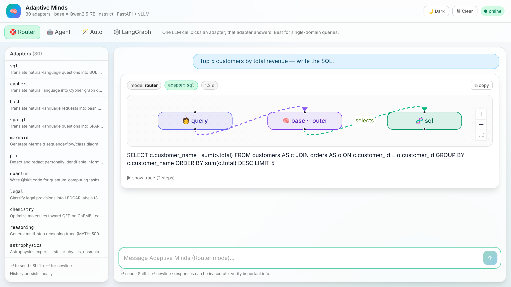

<div align="center">

# 🧠 Adaptive Minds

### LoRA adapters as callable tools for one base model

[](LICENSE)
[](https://www.python.org/downloads/)
[](https://github.com/qpiai/adaptive-minds/actions/workflows/test.yml)
[](https://huggingface.co/pavan01729/adaptive-minds-loras)
[](https://arxiv.org/abs/2510.15416)

**One base model. Many LoRA experts. The model picks which one(s) to use.**

[Quickstart](#-quickstart-docker) · [Try it](#-try-it) · [Reproduce paper results](#-reproducing-paper-results) · [Architecture](docs/ARCHITECTURE.md) · [Contributing](CONTRIBUTING.md)

</div>

---



<sub><i>The Next.js chat UI. Four modes — Router · Agent · Auto · LangGraph — over the same FastAPI / vLLM stack. Capture your own with <code>python scripts/capture_demo.py</code> after <code>docker compose up -d</code>.</i></sub>

---

## What is this?

Instead of merging LoRAs into one weight blend, **Adaptive Minds keeps each adapter as a named, callable tool**. vLLM serves the base model + every adapter from one endpoint; the runtime is pure Python over the OpenAI-compatible HTTP surface — no bespoke serving stack. The base model picks the right adapter at inference time, either in a single call (Router) or via a multi-step ReAct loop that can also dispatch external tools (Agent).

## 🚀 Features

| | |
|---|---|
| **🎯 Router** | One base-model call picks the adapter, that adapter answers. **98.3%** routing accuracy on a 30-adapter library (paper Table 1). |
| **🤖 Agent** | ReAct loop with `THOUGHT / CALL / OBSERVATION / FINAL` grammar. CALLs can be adapters *or* external tools. Multi-CALL planning per turn. |
| **🪄 Auto** | Heuristic dispatcher — short single-domain queries go to Router; multi-step / compound queries go to Agent. The decision is returned so you see what was picked and why. |
| **🕸️ LangGraph** | The Agent loop expressed as a `langgraph.StateGraph` (plan → dispatch → synthesise). Same behaviour, observable as node visits. |
| **5 external tools** | `calculator` (sympy), `code` (Python sandbox), `shell` (bash sandbox), `websearch` (DDG), `pulp` (LP solver). Plug in your own with one function. |
| **30 LoRA specialists** | SQL, Cypher, SPARQL, bash, Mermaid, PII, quantum, legal, chem + 21 domain experts. All on the HF Hub; one YAML adds your own. |
| **FastAPI server** | `/health`, `/adapters`, `/route`, `/agent`, `/chat`. Pydantic-validated, CORS-open, no torch/transformers in the server layer. |
| **Next.js chat UI** | Four-mode tab nav (Router / Agent / Auto / LangGraph), adapter sidebar, trace expander, `@xyflow/react` decision + state-graph viz. Tailwind + framer-motion + react-markdown. Talks to FastAPI directly (CORS open). Port `7007`. |
| **Docker compose** | `docker compose up -d` brings up vLLM + server + UI. |
| **Reproducible evals** | `evals/routing_table1.py` and `evals/mmlu_three_way.py` for paper Tables 1 and 3; shared SFT recipe in `training/` for Table 2. |
| **151-query gold set** | Hand-labeled router benchmark ships in `evals/gold/routing_gold.jsonl`. |
| **`nanoam.py`** | A self-contained 295-line reference impl. `cat nanoam.py` to grasp the whole framework in 5 minutes. |
| **CI + tests** | 41 pytest cases, no GPU/network needed. Matrix on Python 3.10 / 3.11 / 3.12. |

## ⚡ Quickstart (Docker)

```bash
git clone https://github.com/qpiai/adaptive-minds
cd adaptive-minds
cp .env.example .env             # then fill in HF_TOKEN
docker compose up -d
```

That's it. Wait for vLLM to download the base model + all 30 LoRA adapters (~15–30 min first time, watch `docker compose logs -f vllm`), then open **http://localhost:7007**. The browser talks to FastAPI through the Next.js proxy (`/api/am/*`), so the same stack works on localhost, a public IP, or behind a reverse proxy with no config changes.

For a faster first boot, swap to the 2-adapter smoke catalog: set `AM_CATALOG=/app/catalogs/qwen25_smoke.yaml` in `.env` and trim `docker-compose.yml`'s `vllm` `--lora-modules` to just `chemistry` + `sql`.

## 🐍 Quickstart (pip, against an existing vLLM)

```bash
pip install -e ".[serve,tools]"
export VLLM_BASE=http://your-vllm-host:8000/v1

# 1. Start the FastAPI server
adaptive-minds server --catalog catalogs/qwen25_30.yaml &

# 2. (Optional) launch the Next.js UI from source
cd ui && npm install && NEXT_PUBLIC_AM_API_BASE=http://localhost:8765 npm run dev

# 3. Or use the CLI directly:
adaptive-minds route --catalog catalogs/qwen25_30.yaml \
    --query "Write a SQL query for top 10 customers by revenue in 2023."

adaptive-minds agent --catalog catalogs/qwen25_30.yaml \
    --query "Compute 2**32+17, then explain the figure in finance terms."
```

## 🧪 Try it

**Via curl:**

```bash
curl -s :8765/health | jq .
curl -s :8765/adapters | jq 'map(.id)'

curl -s :8765/route \
  -H 'Content-Type: application/json' \
  -d '{"query": "Write SQL to find top 5 customers by revenue."}' \
  | jq '.adapter_id, .response'

curl -s :8765/agent \
  -H 'Content-Type: application/json' \
  -d '{"query": "Compute 2**16+17, then explain it as a finance metric."}' \
  | jq -r .response
```

**Via Python:**

```python
from adaptive_minds import load_catalog, run_router, run_agent
from adaptive_minds.catalog import router_cfg

cat = load_catalog("catalogs/qwen25_30.yaml")
cfg = router_cfg("catalogs/qwen25_30.yaml")

r = run_router("How do you optimize a SPARQL query?", cat, cfg, 0.3, 256)
print(r["adapter_id"], "→", r["response"])
```

## 🏗 Architecture

> **The shortest path to understanding**: read [`nanoam.py`](nanoam.py) (≤300 lines). It's the whole framework — catalog loader, vLLM client, router, agent loop, two tool handlers, `__main__` — in one file with stdlib + `requests` + `PyYAML`. The `adaptive_minds/` package is the same shape with FastAPI, sandboxed tools, evals, and Docker wrapped around it.

```
┌──────────────┐    ┌───────────────┐    ┌────────────────────────────┐
│  Next.js UI  │ ─▶ │  FastAPI      │ ─▶ │  vLLM (OpenAI /v1)         │
│  ui/         │    │  /chat /route │    │  base model                │
│  (port 7007) │    │  /agent       │    │  + LoRA adapters by name   │
└──────────────┘    └───────────────┘    └────────────────────────────┘
                            │
                            ├─ run_router      ── single-step semantic routing (paper §5.2)
                            ├─ run_agent       ── ReAct loop with adapters+tools (paper §5.4)
                            ├─ run_auto        ── heuristic dispatcher: router vs agent
                            └─ langgraph_agent ── StateGraph (plan → dispatch → synthesise)
```

- **Single source of truth**: one YAML catalog drives both the `vllm serve` launch command and the runtime's adapter selection.
- **No model weights in the server**: `adaptive_minds.server` is fastapi + pydantic + requests. All inference is HTTP to vLLM.
- **Small core**: ~1.66 k lines across eleven `.py` files; every public function has a docstring that says *why* it exists.

See [`docs/ARCHITECTURE.md`](docs/ARCHITECTURE.md) for a fuller walk-through.

## 📊 Reproducing paper results

| Paper       | Command                                                                              |
|-------------|--------------------------------------------------------------------------------------|
| **Table 1** | `python -m evals.routing_table1 --catalog catalogs/qwen25_30.yaml`                   |
| **Table 1** (keyword baseline) | `python -m evals.routing_keyword_baseline --catalog catalogs/qwen25_30.yaml` |
| **Table 2** | See [`training/README.md`](training/README.md) — shared SFT recipe + benchmark map   |
| **Table 3** | `python -m evals.mmlu_three_way --catalog catalogs/qwen25_30.yaml --n 10`            |

Full details in [`evals/README.md`](evals/README.md).

## 🧰 Bring your own adapter

1. Train a LoRA with the shared recipe (or use any existing PEFT LoRA on the catalog's base model):
   ```bash
   python training/train_sft.py \
       --dataset hf://your-org/your-dataset \
       --base-model Qwen/Qwen2.5-7B-Instruct \
       --lora-name qwen25_my_expert_v1
   ```
2. Push to the Hub (or any HF-compatible repo), then add an entry to `catalogs/qwen25_30.yaml`:
   ```yaml
   - name: MyExpert
     hf_subdir: qwen2.5-7b/qwen25_my_expert_v1
     description: One sentence the router will see.
     system_prompt: You are an expert in …
     keywords: [topic, related, terms]
     enabled: true
   ```
3. Restart vLLM + server. The new adapter is routable.

## 🗂 Project layout

```
adaptive-minds/
├── adaptive_minds/      # runtime: router, agent, tools, catalog, server, CLI
├── ui/                  # Next.js 14 chat UI (Tailwind + framer-motion + xyflow)
├── catalogs/            # YAML adapter catalogs (30-adapter + 2-adapter smoke)
├── evals/               # paper-table reproduction scripts + 151-query gold set
├── training/            # shared SFT recipe + per-benchmark mapping
├── examples/            # python + curl quickstart scripts
├── docker/              # Dockerfile.server, Dockerfile.ui
├── docs/                # ARCHITECTURE.md + screenshots
├── tests/               # pytest, no GPU/network needed
└── docker-compose.yml   # vllm + server + ui
```

## 🗺 Roadmap

These are intentionally out of v0.1 to keep the public surface minimal:

- **Entropy H(Q) mode classifier** (paper §5.5) — auto-selects router vs agent based on the base model's first-16-token entropy.
- **SSE streaming** in the UI (server already structured for it).
- **PEFT-backed in-process runtime** for single-GPU deployments.
- **Per-benchmark GRPO recipes** (legal / chemistry / quantum use GRPO stage-2 in the paper).
- **Appendix C MCQ harness** — four-adapter reasoning-trace eval on Qwen3.5-9B.
- **Adapter-fusion experiments** (paper §3.3 contrast with LoRA Soups).

## 🤝 Contributing

PRs welcome — see [`CONTRIBUTING.md`](CONTRIBUTING.md) for setup, testing, and what we will / won't merge.

## 📚 Citation

If you use this work, please cite the paper:

> Shekar, P. & Krishnan, N. *Adaptive Minds: Empowering Agents with LoRA-as-Tools*. arXiv:[2510.15416](https://arxiv.org/abs/2510.15416), Oct 2025.

```bibtex
@misc{shekar2025adaptiveminds,
  title  = {Adaptive Minds: Empowering Agents with {LoRA}-as-Tools},
  author = {Shekar, Pavan and Krishnan, Niranjan},
  year   = {2025},
  eprint = {2510.15416},
  archivePrefix = {arXiv},
  primaryClass  = {cs.CL},
  url    = {https://arxiv.org/abs/2510.15416}
}
```

## 📄 License

Apache 2.0. See [`LICENSE`](LICENSE).
