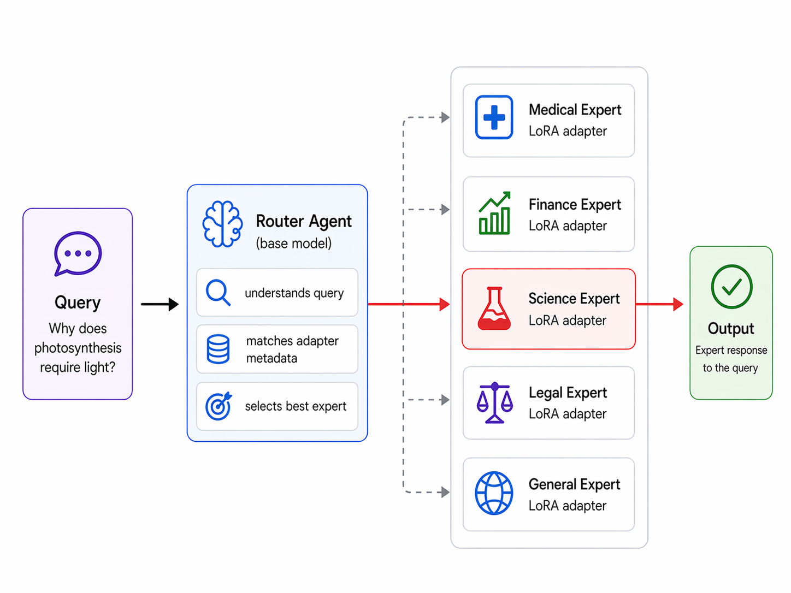
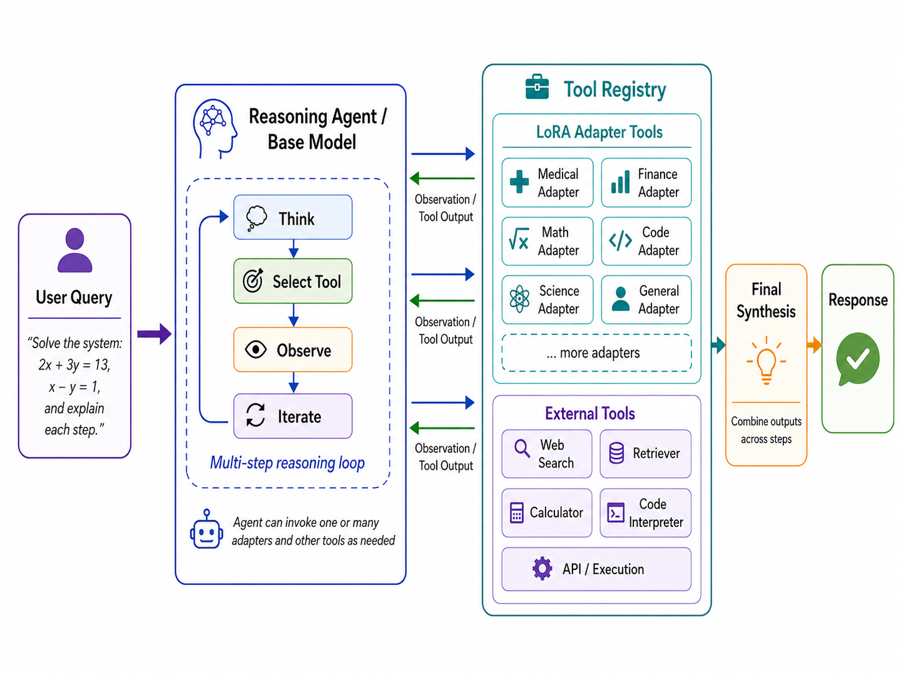
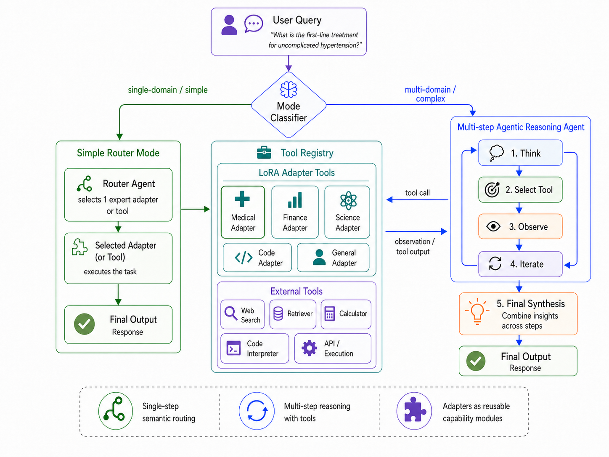

<div align="center">

# 🧠 Adaptive Minds

### Empowering Agents with LoRA-as-Tools

[](LICENSE)
[](https://www.python.org/downloads/)
[](https://github.com/qpiai/adaptive-minds/actions/workflows/test.yml)
[](https://huggingface.co/pavan01729/adaptive-minds-loras)
[](https://arxiv.org/abs/2510.15416)

**One base model. Many LoRA experts. The model picks which one(s) to use — and you can see why.**

[Key results](#-key-results) · [How it works](#-how-it-works--four-modes-one-framework) · [Quickstart](#-quickstart-docker) · [Reproduce paper](#-reproducing-paper-results) · [Architecture](docs/ARCHITECTURE.md)

</div>

---

<!-- Inline player with audio (uploaded to issue #1; GitHub renders it as a video). Click to play with sound. -->

https://github.com/user-attachments/assets/45a8f228-dac0-4f77-8a89-93d03a697d06

<div align="center"><sub><i>▶︎ Click to play (with sound) — a 60-second tour: Router → LangGraph on the live 30-adapter stack.&nbsp; · &nbsp;Silent GIF: <a href="docs/demo.gif">docs/demo.gif</a> &nbsp;·&nbsp; Full MP4: <a href="docs/demo.mp4">docs/demo.mp4</a></i></sub></div>

---

## What is this?

> **Adapters are tools — and like any tool, the quality of each one matters enormously.** Train good adapters, and the framework takes care of the rest: discovering them, picking the right one(s) for each query, and composing them into an answer. Better adapters strictly help; weak ones simply don't get selected.

Two of the most useful ideas in modern LLMs have lived in separate worlds: **parameter-efficient specialization** (LoRA adapters that make a base model great at one domain) and **tool-augmented agents** (models that reason by calling tools). **Adaptive Minds unifies them** — it treats each LoRA adapter as a *named, callable tool* and lets the base model decide **which** adapter to use, **when**, **how often**, and **in what order**.

Instead of merging LoRAs into one weight blend, every adapter stays a distinct, inspectable tool served by a **single vLLM engine**. The base model orchestrates them — in one call (**Router**) or across a multi-step reasoning loop that can also reach external tools (**Agent**). Because every adapter call is an explicit, named action, you get an **auditable trace** of how the answer was produced — something parameter-merging can't give you.

- 🎯 **Model-driven routing** — 98.3% accuracy picking the right expert from a 30-adapter library (vs 31.7% for keyword matching).
- 🧩 **Adapters as tools** — add or remove experts at deploy time; no router retraining, no weight merging.
- 🔍 **Auditable** — an explicit `CALL` / `OBSERVATION` trace instead of entangled merged weights.
- ⚡ **One engine** — vLLM serves the base + all adapters by name; Router mode is **3.1× faster** than the agent baseline.
- 🖥️ **Batteries included** — FastAPI server, Next.js chat UI (light/dark), Docker compose, 30 adapters on the HF Hub, reproducible evals, and a 295-line `nanoam.py` reference.

## ✨ Key results

*From the paper ([arXiv 2510.15416](https://arxiv.org/abs/2510.15416)).*

| Result | Number |
|---|---|
| Routing accuracy — **30-adapter** library | **98.3%** &nbsp;(vs 31.7% keyword · **+66.6 pp**) |
| Routing accuracy — 5-adapter library | **100%** &nbsp;(vs 48.3% keyword · +51.7 pp) |
| Specialist gains over base — 9 task families | **+4.6 → +84.0 pp** (strict scorer) |
| Router vs. directly-pinned specialist | within **±5 pp** on every benchmark |
| Router-mode latency | **3.1× faster** than the agent baseline (3.49 s vs 10.81 s) |

Representative per-domain specialist gains (Table 2): SQL **+29.4**, Text2Cypher **+39.3**, PII redaction **+76.3**, legal/LEDGAR **+84.0**, chemistry/SMILES **+30.4** — and the router recovers each automatically, without a human picking the expert.

**Three findings hold the framework together:**

1. **Specialists help where the base has a real gap.** On weak-base structured generation and niche tasks the gains are large; on strong-base reasoning (MATH-500, GSM8K) they stay within ±2 pp. Adapter *quality* is the multiplier.
2. **The router aggregates those gains** — within ±5 pp of the directly-pinned specialist on every benchmark whose queries carry domain signal.
3. **Routing is reliable at scale** — 98.3% even as the adapter pool grows 6× and the boundaries become semantic rather than keyword-like.

## 🧭 How it works — four modes, one framework

### 🎯 Router — single-step semantic routing

<div align="center"></div>

One base-model call reads the query, matches it against adapter metadata, and selects the best expert; that adapter answers. No keyword rules, no hand-written dispatch — the model *is* the router. Best for clear, single-domain queries. *(paper §5.2)*

### 🤖 Agent — multi-step ReAct reasoning

<div align="center"></div>

For tasks that need decomposition, the base model runs a **THOUGHT → CALL → OBSERVATION → FINAL** loop, invoking LoRA experts **and** external tools (calculator, code, shell, web, LP solver) across steps, then synthesises a final answer. Here adapters are composable skills, not just one-shot specialists. *(paper §5.4)*

### 🪄 Auto — let the model choose the mode

A lightweight classifier sizes up the query and dispatches it: short, single-domain → **Router**; compound or multi-step → **Agent**. The decision (and the reason) is returned alongside the answer. The paper's entropy gate uses the base model's first-16-token entropy H(Q): `H < 0.8 → Router`, `H > 1.5 → Agent`. See the unified diagram in [System architecture](#-system-architecture) below. *(paper §5.5)*

### 🕸️ LangGraph — the agent as a state graph

The same ReAct behaviour expressed as a `langgraph.StateGraph` (**plan → dispatch → synthesise**), so each run is observable as node visits — handy for tracing and for wiring Adaptive Minds into existing LangGraph pipelines.

## 🏗 System architecture

<div align="center"></div>

One classifier, two operating regimes, a shared tool registry of LoRA adapters + external tools. The design principles:

- **Single source of truth** — one YAML catalog drives *both* the `vllm serve` launch command and the runtime's adapter selection. Adding an expert is "edit YAML, restart vLLM, done."
- **No model weights in the server** — `adaptive_minds.server` is FastAPI + Pydantic + `requests`; all inference is HTTP to vLLM. The browser reaches it through the Next.js proxy (`/api/am/*`), so the same stack works on localhost, a public IP, or behind a reverse proxy.
- **Small core** — ~1.66 k lines across eleven `.py` files; every public function has a docstring that says *why* it exists.

> **Shortest path to understanding:** read [`nanoam.py`](nanoam.py) (≤300 lines) — catalog loader, vLLM client, router, agent loop, two tool handlers, and `__main__` in one file with just stdlib + `requests` + `PyYAML`. The `adaptive_minds/` package is the same shape with FastAPI, sandboxed tools, evals, and Docker around it. Full walk-through: [`docs/ARCHITECTURE.md`](docs/ARCHITECTURE.md).

## 📦 What's included

| | |
|---|---|
| **5 external tools** | `calculator` (sympy) · `code` (sandbox) · `shell` (sandbox) · `websearch` (DDG) · `pulp` (LP solver). One function to add your own. |
| **30 LoRA specialists** | SQL, Cypher, SPARQL, bash, Mermaid, PII, quantum, legal, chem + 21 more — all on the HF Hub. |
| **FastAPI server** | `/health` · `/adapters` · `/route` · `/agent` · `/chat`. Pydantic-validated, CORS-open, no torch/transformers in the server layer. |
| **Next.js chat UI** | Light/dark, four-mode tabs, adapter sidebar, trace expander, `@xyflow/react` decision + state-graph viz. Port `7007`. |
| **Docker compose** | `docker compose up -d` → vLLM + server + UI. |
| **Reproducible evals** | scripts for paper Tables 1 & 3 + a 151-query hand-labeled gold set. |
| **`nanoam.py`** | the whole framework in 295 lines. |
| **CI + tests** | 42 hermetic pytest cases (no GPU/network); matrix on Python 3.10 / 3.11 / 3.12. |

## ⚡ Quickstart (Docker)

```bash
git clone https://github.com/qpiai/adaptive-minds
cd adaptive-minds
cp .env.example .env             # then fill in HF_TOKEN
docker compose up -d
```

That's it. Wait for vLLM to download the base model + all 30 LoRA adapters (~15–30 min first time, watch `docker compose logs -f vllm`), then open **http://localhost:7007**.

For a faster first boot, swap to the 2-adapter smoke catalog: set `AM_CATALOG=/app/catalogs/qwen25_smoke.yaml` in `.env` and trim `docker-compose.yml`'s `vllm` `--lora-modules` to just `chemistry` + `sql`.

## 🐍 Quickstart (pip, against an existing vLLM)

```bash
pip install -e ".[serve,tools]"
export VLLM_BASE=http://your-vllm-host:8000/v1

# 1. Start the FastAPI server
adaptive-minds server --catalog catalogs/qwen25_30.yaml &

# 2. (Optional) launch the Next.js UI from source
cd ui && npm install && npm run dev

# 3. Or use the CLI directly:
adaptive-minds route --catalog catalogs/qwen25_30.yaml \
    --query "Write a SQL query for top 10 customers by revenue in 2023."

adaptive-minds agent --catalog catalogs/qwen25_30.yaml \
    --query "Compute 2**32+17, then explain the figure in finance terms."
```

## 🧪 Try it

**Via curl:**

```bash
curl -s :8765/health | jq .
curl -s :8765/adapters | jq 'map(.id)'

curl -s :8765/route \
  -H 'Content-Type: application/json' \
  -d '{"query": "Write SQL to find top 5 customers by revenue."}' \
  | jq '.adapter_id, .response'

curl -s :8765/agent \
  -H 'Content-Type: application/json' \
  -d '{"query": "Compute 2**16+17, then explain it as a finance metric."}' \
  | jq -r .response
```

**Via Python:**

```python
from adaptive_minds import load_catalog, run_router, run_agent
from adaptive_minds.catalog import router_cfg

cat = load_catalog("catalogs/qwen25_30.yaml")
cfg = router_cfg("catalogs/qwen25_30.yaml")

r = run_router("How do you optimize a SPARQL query?", cat, cfg, 0.3, 256)
print(r["adapter_id"], "→", r["response"])
```

## 📊 Reproducing paper results

| Paper | What it measures | Command |
|---|---|---|
| **Table 1** | router accuracy on the 30-adapter library | `python -m evals.routing_table1 --catalog catalogs/qwen25_30.yaml` |
| **Table 1** | keyword-matching baseline | `python -m evals.routing_keyword_baseline --catalog catalogs/qwen25_30.yaml` |
| **Table 2** | per-specialist gains over base | see [`training/README.md`](training/README.md) — shared recipe + benchmark map |
| **Table 3** | three-way (vanilla / router / agent) on MMLU | `python -m evals.mmlu_three_way --catalog catalogs/qwen25_30.yaml --n 10` |

Full details in [`evals/README.md`](evals/README.md).

## 🧰 Bring your own adapter

1. Train a LoRA with the shared recipe (or reuse any PEFT LoRA on the catalog's base model):
   ```bash
   python training/train_sft.py \
       --dataset hf://your-org/your-dataset \
       --base-model Qwen/Qwen2.5-7B-Instruct \
       --lora-name qwen25_my_expert_v1
   ```
   The paper's adapters use **LoRA r=32, α=64, all-linear targets**, ~500 SFT steps for reasoning-trace experts; structured-generation specialists add 400–600 SFT + ~200 GRPO steps with an execution-based reward (the 30-adapter pool uses a lighter r=16 / 100-step recipe for breadth). A "train-as-a-tool" pipeline can build a fresh adapter from web pages in ~21 min on a single L40S.
2. Push to the Hub (or any HF-compatible repo), then add an entry to `catalogs/qwen25_30.yaml`:
   ```yaml
   - name: MyExpert
     hf_subdir: qwen2.5-7b/qwen25_my_expert_v1
     description: One sentence the router will see.
     system_prompt: You are an expert in …
     keywords: [topic, related, terms]
     enabled: true
   ```
3. Restart vLLM + server. The new adapter is routable — no router retraining needed.

## ⚖️ When it helps (and when it doesn't)

Adaptive Minds is honest about where the gains come from:

- ✅ **Big wins where the base has a real gap** — structured generation (SQL, Cypher, SPARQL, Mermaid) and niche formats (PII, legal labels, SMILES). This is where specialists earn their +30 → +84 pp.
- ➖ **Marginal on strong-base reasoning** — on MATH-500 / GSM8K the recipe moves accuracy < ±2 pp; the base is already capable, so routing mostly preserves it.
- ⚠️ **Out-of-distribution MCQ** — on GPQA Diamond, single-step routing *underperforms* the base (−20.7 pp) because specialist output format mismatches the strict scorer; the multi-step **Agent** loop, keeping the base model as controller, recovers to within ~1.3 pp.

The takeaway: **train good adapters; the framework makes them available on the right query at the right time.** Better adapters strictly help; weak ones simply don't get selected.

## 🗂 Project layout

```
adaptive-minds/
├── adaptive_minds/      # runtime: router, agent, auto, langgraph, tools, catalog, server, CLI
├── ui/                  # Next.js 14 chat UI (light/dark, Tailwind + framer-motion + xyflow)
├── catalogs/            # YAML adapter catalogs (30-adapter + 2-adapter smoke)
├── evals/               # paper-table reproduction scripts + 151-query gold set
├── training/            # shared SFT recipe + per-benchmark mapping
├── examples/            # python + curl quickstart scripts
├── docker/              # Dockerfile.server, Dockerfile.ui
├── docs/                # ARCHITECTURE.md + figures + demo media
├── video/               # Remotion intro/outro for the demo video
├── scripts/             # capture_demo.py + build_demo.sh
├── tests/               # pytest, no GPU/network needed
├── nanoam.py            # the whole framework in one 295-line file
└── docker-compose.yml   # vllm + server + ui
```

## 🗺 Roadmap

The big questions we'd love to push on next — contributions and ideas are very welcome 🙏:

- **🧩 Adapters as truly first-class tools.** Make the agent reach for adapters as naturally as any other tool — including *train-as-a-tool*: when no existing specialist fits, commission and train a new one on the fly, then route to it.
- **📈 Scale to hundreds → thousands of adapters.** Our study covers 30; we want to learn how reliably model-driven routing holds as the library grows large and the boundaries blur — and what indexing / retrieval the router needs at that scale.
- **🎓 Better ways to train the adapters.** Quality is the multiplier, so finding the data, recipes, and evaluation that reliably produce strong specialists is where most of the leverage is.

Smaller, practical items: SSE streaming in the UI · a PEFT-backed in-process runtime for single-GPU setups · adapter-fusion experiments (paper §3.3, vs. LoRA Soups).

## 🤝 Contributing

PRs, issues, and ideas are very welcome — thank you for helping make this better! Please see [`CONTRIBUTING.md`](CONTRIBUTING.md) for setup, testing, and what we will / won't merge.

## 📚 Citation

If you use this work, please cite the paper:

> Shekar, P. & Krishnan, N. *Adaptive Minds: Empowering Agents with LoRA-as-Tools*. arXiv:[2510.15416](https://arxiv.org/abs/2510.15416), Oct 2025.

```bibtex
@misc{shekar2025adaptiveminds,
  title  = {Adaptive Minds: Empowering Agents with {LoRA}-as-Tools},
  author = {Shekar, Pavan and Krishnan, Niranjan},
  year   = {2025},
  eprint = {2510.15416},
  archivePrefix = {arXiv},
  primaryClass  = {cs.CL},
  url    = {https://arxiv.org/abs/2510.15416}
}
```

## 🙏 Acknowledgements

Adaptive Minds stands on the shoulders of wonderful open source — [vLLM](https://github.com/vllm-project/vllm) for multi-LoRA serving, [Hugging Face](https://huggingface.co/) for the model + adapter hub, [LangGraph](https://github.com/langchain-ai/langgraph) for the state-graph mode, and Next.js + Tailwind for the UI. Thank you to everyone building these. And thank *you* for taking the time to look at this project — if it's useful to you, we'd genuinely love to hear about it.

## 📄 License

Apache 2.0. See [`LICENSE`](LICENSE).
