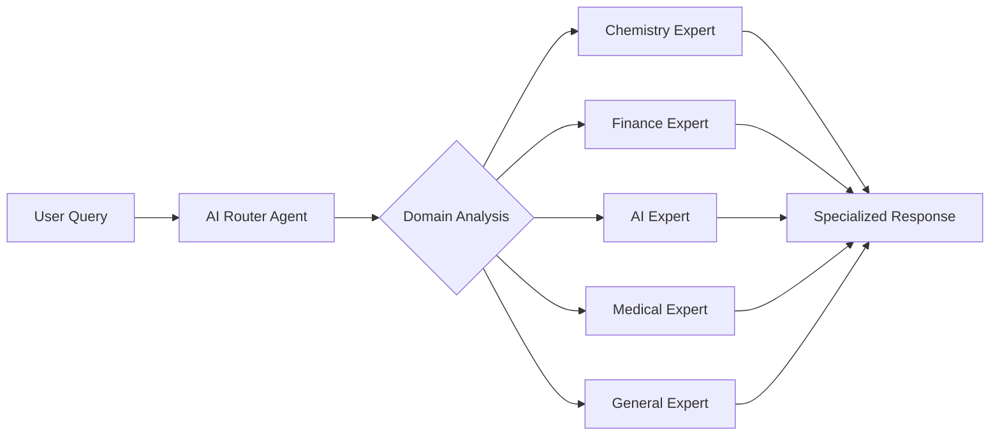

# 🧠 Adaptive Minds

**Smart AI that picks the right expert for your question using LoRA adapter tools**

[](https://opensource.org/licenses/Apache-2.0)
[](https://huggingface.co/collections/pavan01729/adaptive-minds-68cbab3565664604be49a462)
[](https://www.python.org/downloads/)
[](https://www.docker.com/)


Adaptive Minds transforms LoRA adapters into **specialized tools** for AI agents. Instead of using a single general-purpose model, it employs an intelligent router that automatically selects the most appropriate LoRA adapter for each query, effectively giving the AI agent access to domain-specific expertise on demand. This approach enables more accurate and specialized responses by treating each LoRA adapter as a specialized tool in the agent's toolkit.

## ✨ Key Features

- 🎯 **Intelligent Routing**: AI automatically selects the best domain expert for each query
- 🧠 **5 Domain Experts**: Chemistry, Finance, AI, Medical, and General knowledge
- 🔄 **Multi-Agent Architecture**: Built with LangGraph for robust workflow management
- 💬 **Dual Interface**: FastAPI backend + Streamlit web UI
- 🚀 **One-Command Deployment**: Docker Compose with GPU support
- 📊 **Transparent Reasoning**: See why each expert was selected
- 🔗 **Conversation Memory**: Context-aware responses across interactions


## 🏗️ How It Works



1. **User sends a query** via API or web interface
2. **AI Router Agent** analyzes the query using the base Llama 3.1 model
3. **Domain selection** happens through semantic understanding
4. **Expert Agent** generates response using the selected domain-specific LoRA adapter
5. **Response delivered** with reasoning about why that expert was chosen

## 🚀 Quick Start

### Prerequisites
- Docker with GPU support
- NVIDIA GPU with 8GB+ VRAM
- Hugging Face account (for Llama 3.1 access)

### 1. Get Hugging Face Access

**Required:** You need access to Meta's Llama 3.1 model on Hugging Face.

1. **Create a Hugging Face account** at [huggingface.co](https://huggingface.co)

2. **Accept the Llama 3.1 license:**
   - Visit: https://huggingface.co/meta-llama/Llama-3.1-8B-Instruct
   - Click "Accept" on the license agreement
   - Wait for approval (usually instant)

3. **Get your access token:**
   ```bash
   # Get your token from: https://huggingface.co/settings/tokens
   # Create a new token with "Read" permissions
   export HF_TOKEN=your_actual_token_here
   ```

   **💡 Recommended:** Create a `.env` file for persistent storage:
   ```bash
   # Create .env file in project root
   cat > .env << EOF
   HF_TOKEN=your_actual_token_here
   EOF
   
   # Docker Compose will automatically load this file
   # No need to export manually each time!
   ```
   
   **Alternative:** Copy and edit the example template:
   ```bash
   # Create from template
   cp .env.example .env
   # Then edit .env with your actual token
   ```
   
   ⚠️ **Security Note:** The `.env` file is already in `.gitignore` - never commit tokens to version control!

4. **Verify access:**
   ```bash
   # Test your token works
   curl -H "Authorization: Bearer $HF_TOKEN" \
        https://huggingface.co/api/models/meta-llama/Llama-3.1-8B-Instruct
   ```

### 2. Run the System
```bash
git clone https://github.com/yourusername/adaptive_minds_oss.git
cd adaptive_minds_oss

# Create .env file with your HF token (if not done already)
echo "HF_TOKEN=your_actual_token_here" > .env

# Start the system (first run downloads ~16GB of models)
docker compose up --build
```

**🕐 First Run:** Initial startup takes 5-10 minutes to download models. Watch for "🎉 ALL SYSTEMS READY!" message.

### 3. Use the System

**Web Interface:**
- Open http://localhost:8501 for the Streamlit UI

**API Interface:**
```bash
# Send a query
curl -X POST http://localhost:8765/chat \
  -H "Content-Type: application/json" \
  -d '{"query": "What is the molecular formula of caffeine?"}'

# Check system status
curl http://localhost:8765/status
```

## 🎯 Examples & Usage

### 📚 Ready-to-Run Examples

We've included several examples to help you get started:

```bash
# 🐍 Python API examples
python examples/basic_usage.py

# 💬 Interactive chat demo
python examples/interactive_demo.py

# 🌐 cURL examples
./examples/curl_examples.sh
```

See the [`examples/`](examples/) directory for detailed usage examples and documentation.

### 🎯 Example Queries

| Query | Selected Expert | Why |
|-------|----------------|-----|
| "What is the molecular formula of water?" | **Chemistry** | Chemical compound question |
| "How does compound interest work?" | **Finance** | Financial concept |
| "Explain machine learning" | **AI** | Technology topic |
| "What are symptoms of flu?" | **Medical** | Health-related question |
| "Hello, how are you?" | **General** | Casual conversation |

## 🔧 Architecture

### Components

- **`server.py`**: FastAPI backend with multi-agent workflow
- **`app_frontend.py`**: Streamlit web interface (connects to FastAPI)
- **`app_standalone.py`**: Streamlit standalone (loads models directly)
- **`download_models.py`**: Hugging Face model downloader

### Models Used

**Base Model**: [meta-llama/Llama-3.1-8B-Instruct](https://huggingface.co/meta-llama/Llama-3.1-8B-Instruct)
- Used by the Router Agent for domain selection
- Requires Hugging Face authentication

**LoRA Adapters** (🔗 [View Complete Collection](https://huggingface.co/collections/pavan01729/adaptive-minds-68cbab3565664604be49a462)):
- **General**: `pavan01729/llama-8B-alpaca-2k` - General conversation and knowledge
- **Chemistry**: `pavan01729/llama-8B-chemistry` - Chemical compounds and reactions  
- **Finance**: `pavan01729/llama-8B-finance-alpaca` - Financial concepts and advice
- **AI**: `pavan01729/llama-8B-gpt-ai` - Technology and programming topics
- **Medical**: `pavan01729/llama-8B-medical-alpaca` - Health and medical information

> 💡 **Training Note**: All LoRA adapters were fine-tuned using [QpiAI Pro](https://www.qpiai-pro.tech/), a no-code platform that simplifies LLM fine-tuning and deployment. This made it easy to create domain-specific adapters without complex coding - perfect for researchers and developers looking to build their own specialized models.

## 📡 API Reference

### POST /chat
Send a query to the system.

**Request:**
```json
{
  "query": "What is photosynthesis?"
}
```

**Response:**
```json
{
  "response": "Photosynthesis is the process by which plants...",
  "selected_adapter": "Chemistry",
  "reasoning": "🔍 Query: 'What is photosynthesis?'\n🤖 AI Selection: Chemistry\n✅ Decision: Chemistry via AI semantic analysis"
}
```

### GET /status
Get system status and loaded models.

**Response:**
```json
{
  "is_initialized": true,
  "loaded_adapters": ["General", "Chemistry", "Finance", "AI", "Medical"],
  "gpu_memory_allocated": 15.2,
  "gpu_memory_reserved": 16.0
}
```

### DELETE /chat/history
Clear conversation history.

## 🛠️ Development

### Local Development
```bash
# Install dependencies
pip install -r build/requirements.txt

# Set environment variables
export HF_TOKEN=your_token_here

# Download models
python build/download_models.py

# Run server
cd build && python server.py

# Run frontend (in another terminal)
cd build && streamlit run app_frontend.py
```

### File Structure
```
adaptive_minds_oss/
├── build/
│   ├── server.py              # FastAPI backend
│   ├── app_frontend.py        # Streamlit web UI (connects to API)
│   ├── app_standalone.py      # Streamlit standalone (loads models)
│   ├── download_models.py     # Model downloader
│   └── requirements.txt       # Python dependencies
├── examples/                  # Usage examples
│   ├── basic_usage.py         # Python API examples
│   ├── interactive_demo.py    # Interactive chat demo
│   ├── curl_examples.sh       # cURL examples
│   └── README.md             # Examples documentation
├── docker-compose.yml         # Docker deployment
├── Dockerfile                 # Container definition
└── README.md                  # This file
```

## 🔧 Configuration

The system automatically downloads and configures all required models. Advanced users can modify:

- **Model paths** in `server.py` (LORA_ADAPTERS configuration)
- **Server settings** in `docker-compose.yml`
- **UI behavior** in the Streamlit apps

## 🐛 Troubleshooting

### Common Issues

**"Access denied" when downloading models:**
- Ensure `HF_TOKEN` is set correctly
- Accept the Llama 3.1 license at the Hugging Face model page
- Verify token has read permissions

**Server fails to start:**
- Check GPU availability: `nvidia-smi`
- Ensure Docker has GPU access
- Verify sufficient GPU memory (8GB+ recommended)

**Models download slowly:**
- First run downloads ~16GB of models
- Use a stable internet connection
- Models are cached for subsequent runs

### System Requirements

- **GPU**: NVIDIA GPU with 8GB+ VRAM
- **RAM**: 16GB+ system RAM recommended
- **Storage**: 20GB+ free space for models
- **Network**: Stable internet for initial model download

## 🤝 Contributing

We welcome contributions! Please see our [Contributing Guidelines](CONTRIBUTING.md) for details.

### Areas for Contribution
- Additional domain-specific adapters
- Performance optimizations
- UI/UX improvements
- Documentation and examples
- Testing and benchmarks

## 📄 License

This project is licensed under the Apache License 2.0 - see the [LICENSE](LICENSE) file for details.

## 🙏 Acknowledgments

- Built with [LangGraph](https://github.com/langchain-ai/langgraph) for multi-agent workflows
- Uses [Hugging Face](https://huggingface.co/) for model hosting and management
- LoRA adapters trained using [PEFT](https://github.com/huggingface/peft)
- Base model: [Meta Llama 3.1](https://huggingface.co/meta-llama/Llama-3.1-8B-Instruct)

## 📊 Performance

- **Response Time**: ~2-5 seconds per query (depending on complexity)
- **Memory Usage**: ~15-20GB GPU VRAM for full system
- **Throughput**: Handles concurrent requests via FastAPI
- **Accuracy**: AI routing achieves >90% domain selection accuracy

---

**Star ⭐ this repository if you find it useful!**